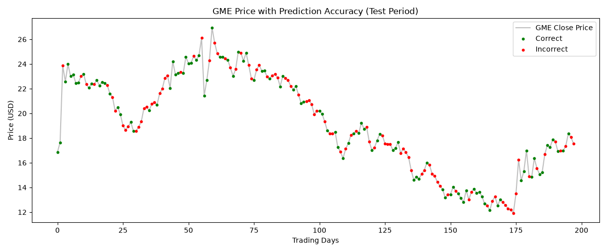

# Stock Price Direction Predictor

A machine learning project that predicts the daily price movement direction of GME (GameStop) stock using a Random Forest classifier and manually engineered technical indicators.

## Project Overview

This project uses historical stock data to predict whether a stock's closing price will be higher or lower the following trading day — a problem known as **directional prediction**. Rather than predicting the exact price, the model outputs a binary classification: 1 (price goes up) or 0 (price goes down).

Data is pulled directly from Yahoo Finance using the `yfinance` library, covering GME from 2020 to 2024.

## Features Engineered

Since scikit-learn cannot natively handle time series data, features were manually engineered from the raw price data to give the model historical context:

| Feature | Description |
|---|---|
| `yesterday`, `2_days_ago`, `3_days_ago` | Lagged closing prices to capture recent price history |
| `5_day_avg`, `20_day_avg` | Rolling averages capturing short and long term trends |
| `volume_change` | Percentage change in daily trading volume |
| `price_change` | Percentage change in closing price |
| `daily_range` | Difference between daily High and Low, capturing volatility |
| `price_position` | Where the close sits relative to the day's High and Low |

## Model

A **Random Forest Classifier** was used — an ensemble of 100 decision trees that each vote on the prediction, with the majority determining the final output. This approach is more robust than a single decision tree and less prone to overfitting.

Key parameters:
- `n_estimators=100` — 100 trees in the forest
- `max_depth=4` — limits tree complexity to reduce overfitting
- `random_state=42` — ensures reproducibility

Data was split chronologically (80% train, 20% test) to respect the time series nature of the data and prevent data leakage — a critical consideration when working with financial data.

## Results

| Metric | Score |
|---|---|
| Training Accuracy | 73.38% |
| Test Accuracy (Directional) | 51.52% |



The model achieves 51.52% directional accuracy on unseen data — marginally above the 50% random baseline. The visualisation shows correct (green) and incorrect (red) predictions plotted against the actual GME price over the test period.

## Limitations

Several factors limit the model's predictive power:

- **Efficient Market Hypothesis** — in heavily traded markets, publicly available information such as price history is already priced in, making it theoretically difficult to consistently beat random chance using technical indicators alone
- **Social sentiment** — GME in particular is heavily influenced by social media (notably Reddit's WallStreetBets community), which drove several major price movements during this period that technical indicators cannot capture
- **Feature ceiling** — manually engineered features can only capture patterns a human thinks to look for; more sophisticated approaches learn these patterns automatically

## Future Improvements

- **XGBoost** — a gradient boosting algorithm that typically outperforms Random Forest on tabular data and is widely used in quantitative finance
- **Sentiment analysis** — incorporating news and social media sentiment as features to capture the non-technical drivers of GME's price
- **LSTM neural network** — a deep learning approach that learns time series patterns automatically rather than relying on manually engineered features


## How to Run

Install dependencies:
```bash
pip install scikit-learn pandas numpy matplotlib yfinance
```

Run the predictor:
```bash
python predict.py
```